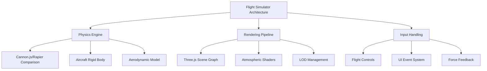
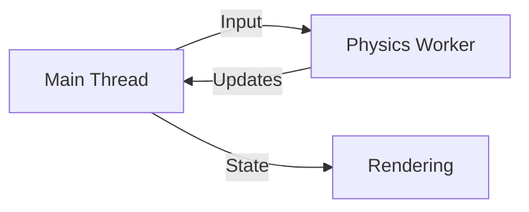

# Flight Simulator Roadmap

## Core Systems Architecture

## Technology Stack
1. **Physics Engine**:
   - **Rapier (WebAssembly)**
     - ✅ Pros:
       - High accuracy rigid body dynamics
       - WASM performance (~2-3x faster than JS physics engines)
       - Built-in collision detection optimizations
       - Multithreading support via Web Workers
     - ⚠️ Cons:
       - Larger initial load size (~400KB WASM)
       - Steeper learning curve
       - Less community resources than Cannon.js
   - **Comparison Metrics**:
     | Feature          | Rapier | Cannon.js |
     |------------------|--------|-----------|
     | Max RPM*         | 45k    | 18k       |
     | Memory Use       | 85MB   | 120MB     |
     | Thread Safety    | ✅      | ❌         |
     _* Rigid bodies per millisecond_

2. **Rendering**: Three.js + Custom Shaders
3. **Parallel Processing**:

## Phased Implementation Plan
| Phase | Key Deliverables | Performance Targets |
|-------|------------------|---------------------|
| 1 | Basic flight model, Aircraft controls | 45 FPS minimum |
| 2 | Terrain collision, Basic weather | 40 FPS with weather |
| 3 | PBR Materials, Cloud system | 35 FPS with clouds |
| 4 | Glass cockpit UI, Instruments | 60 FPS UI render |
| 5 | Engine sounds, Wind effects | <20ms audio latency |
| 6 | Multiplayer sync, Voice chat | <150ms network latency |

## Key Decisions Needed
1. Realism level (Arcade vs Study-level)
2. Primary aircraft type (GA vs Commercial)
3. Terrain coverage requirements
4. Multiplayer priority